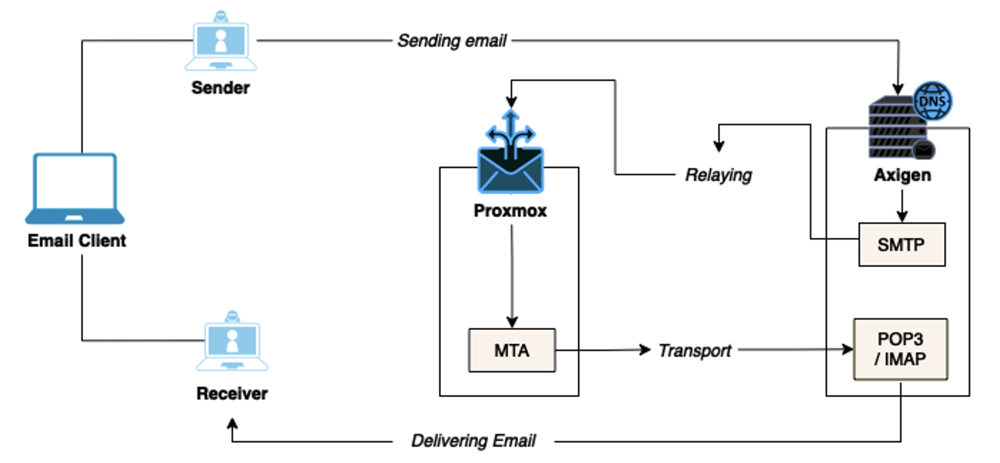
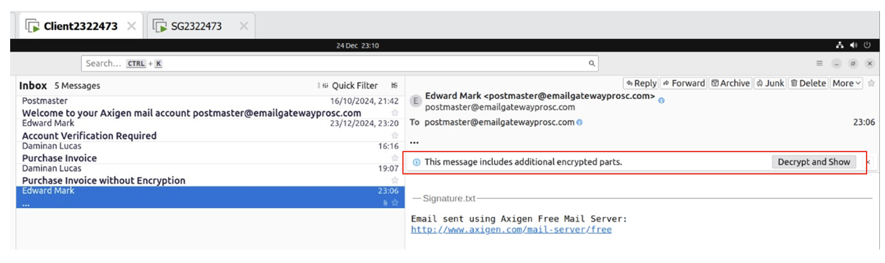
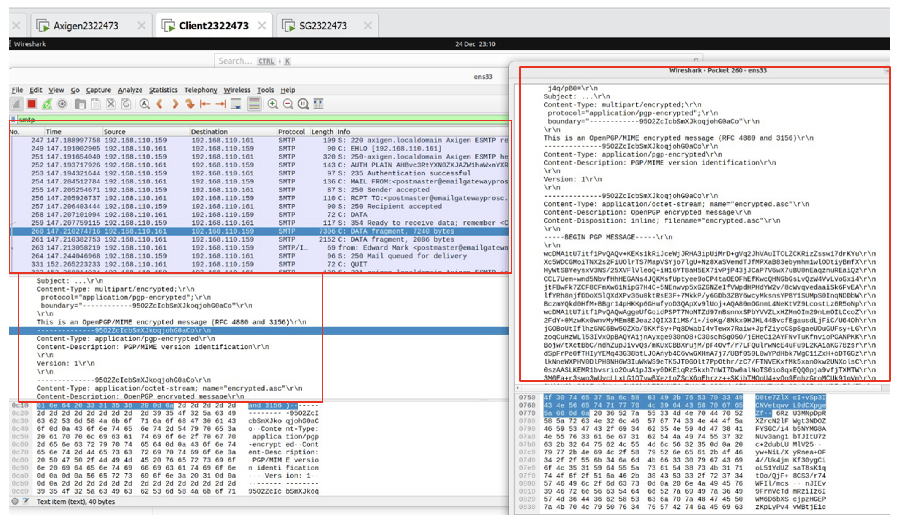
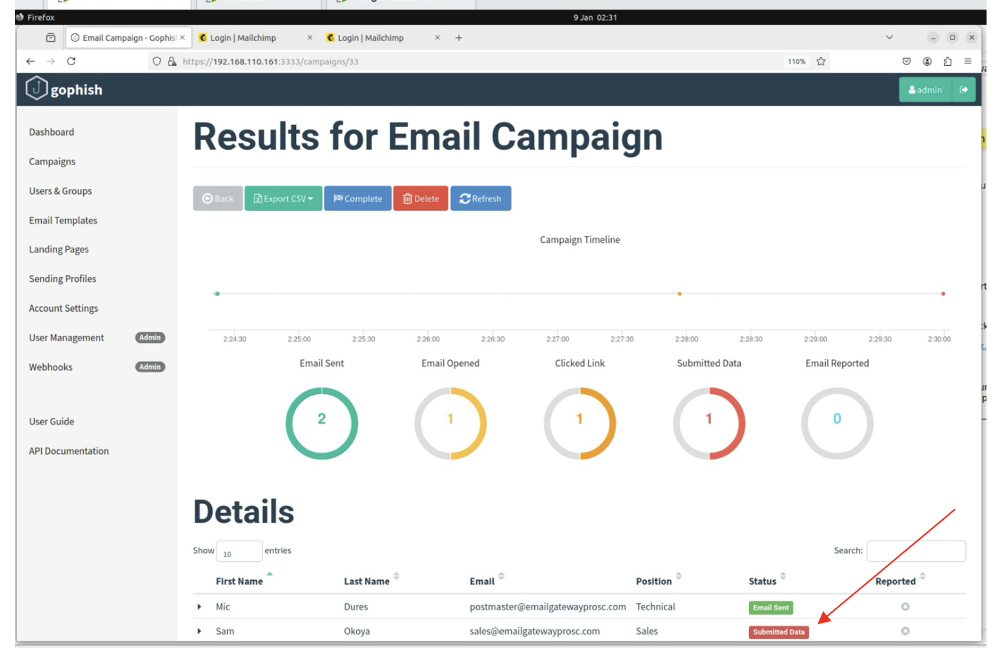
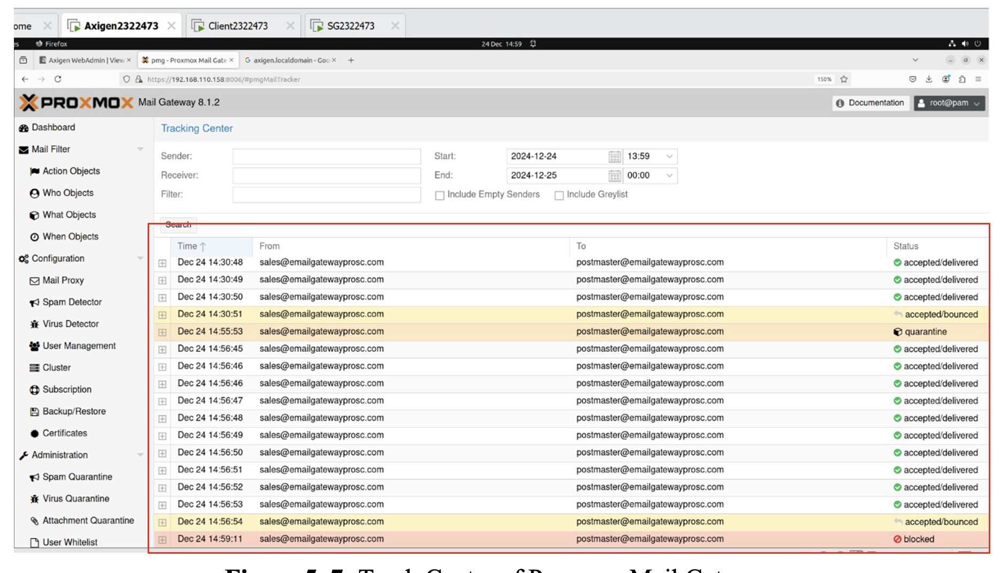
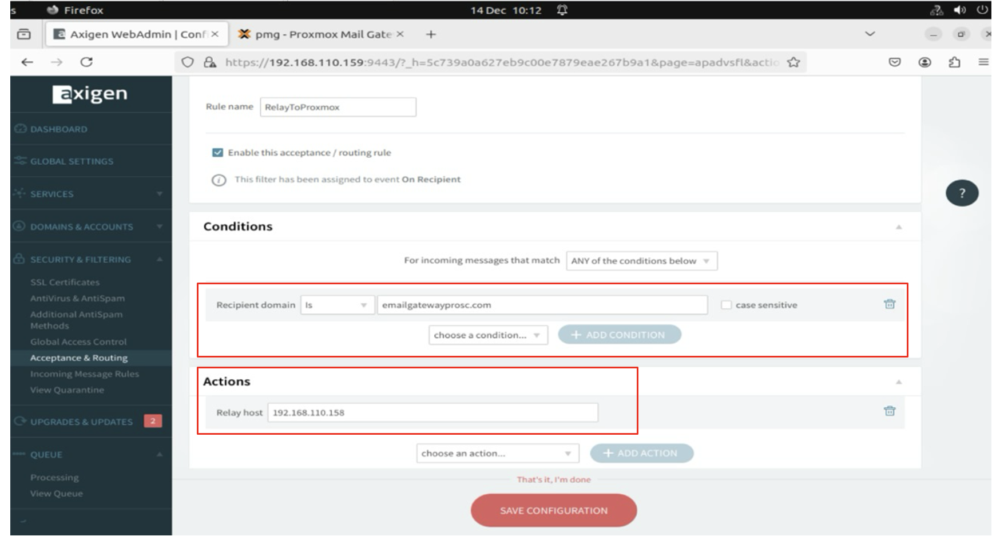
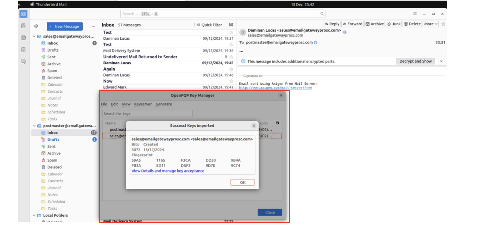
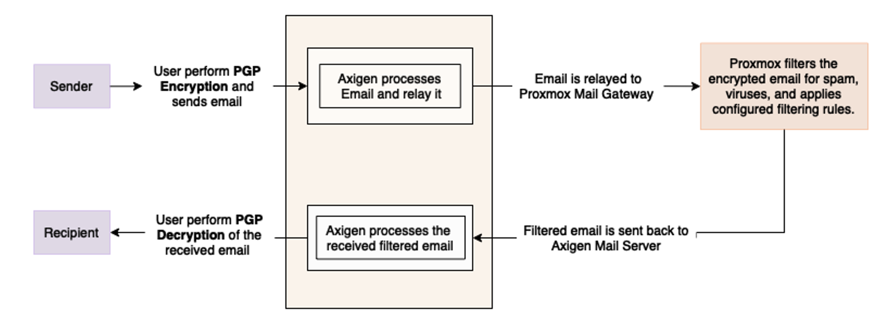
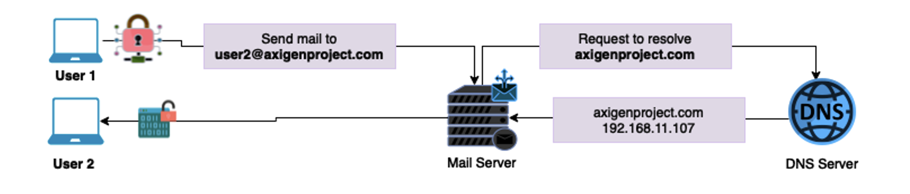
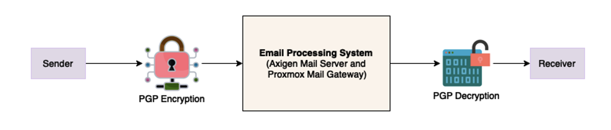

# 🔐 Development of a Secure Email Gateway Architecture Using Open-Source Tools

This project demonstrates a multi-layered email security system built with open-source tools: **Axigen Mail Server**, **Proxmox Mail Gateway**, **Thunderbird**, **GoPhish**, and **PGP Encryption**. It simulates phishing attacks and uses encryption, filtering, and traffic inspection to protect communication channels.

---

## 📁 Repository Structure

```
email-security-gateway/
├── README.md
├── screenshots/
│   ├── architecture-diagram.png
│   ├── axigen-config.png
│   ├── pmg-dashboard.png
│   ├── thunderbird-pgp.png
│   ├── phishing-captured.png
│   ├── email-cleartext.png
│   ├── email-encrypted.png
│   ├── wireshark-cleartext.png
│   ├── wireshark-encrypted.png
│   ├── network-topology.png
│   ├── data-flow.png
│   ├── dns-setup.png
│   ├── security-layers.png
```

---

## 🧠 Project Overview

|                        | Details                                                                 |
|------------------------|-------------------------------------------------------------------------|
| **Objective**          | Build a secure email gateway to detect and block phishing & malware     |
| **Approach**           | Combined encryption, filtering, and simulation to test architecture     |
| **Tools Used**         | Axigen, Proxmox Mail Gateway, Thunderbird, GoPhish, PGP, Wireshark      |
| **Core Defenses**      | Email encryption (PGP), spam/phishing filters, malware detection        |

---

## 🧩 System Architecture



---

## 🔐 PGP Encryption & Analysis

### Plaintext Email (No Encryption)

  


### Encrypted Email (PGP Enabled)

  


> 🔍 Wireshark clearly exposes unencrypted emails but fails to decode PGP-secured ones — proving encryption integrity.

---

## 🚨 Phishing Simulation (GoPhish)

  


- Simulated phishing using GoPhish
- Proxmox identified spoofing, links, and attachments
- Results analyzed and confirmed in dashboards

---

## 🛠 Tool Snapshots

| Tool               | Screenshot |
|--------------------|------------|
| Axigen Mail Server |  |
| PMG Filters        |  |
| Thunderbird + PGP  |  |

---

## 🌐 Network Topology & Data Flow

### 📡 Network Topology

The lab simulates enterprise email communication and attacks.  
Includes internal DNS, SMTP relay, phishing source, and traffic monitor.


---

### 📈 Data Flow Diagram

End-to-end secure email flow, from encryption to delivery, with filtering checkpoints.



---

## 🌍 DNS Server Setup

A local DNS server (e.g., BIND or Axigen DNS) was configured with:

- **MX Record:** `mail.axigenproject.com`
- **A Record:** Points to Axigen IP (e.g., `192.168.11.107`)
- **SPF Record:** Prevents spoofing

```plaintext
Type    | Host                | Points To
--------|---------------------|---------------------
A       | mail.axigenproject.com | 192.168.11.107
MX      | @axigenproject.com     | mail.axigenproject.com
TXT     | @axigenproject.com     | "v=spf1 mx -all"
```



---

## 🔐 Security Layer Design

Multi-layered security approach based on **Defense in Depth**.

| Layer                 | Purpose                                  | Tools Used                |
|----------------------|-------------------------------------------|---------------------------|
| Application Layer    | PGP Encryption                            | Thunderbird + GnuPG       |
| Transport Layer      | Secure SMTP Routing                       | Axigen Mail Server        |
| Network Layer        | Spam/Phishing/Malware Filtering           | Proxmox Mail Gateway      |
| DNS Layer            | Domain Trust & Routing                    | Internal DNS Server       |
| Monitoring Layer     | Visibility & Traffic Inspection           | Wireshark, Snort (opt)    |



---

## ⚙️ Quick Setup Summary

1. 🛠 Install **Axigen** and configure SMTP routing  
2. 🔐 Set up **PGP encryption** in Thunderbird with GnuPG  
3. 🧱 Deploy **Proxmox Mail Gateway** and set filtering policies  
4. 🎯 Simulate phishing with **GoPhish**  
5. 🔍 Capture and analyze email traffic using **Wireshark**

---

## 📊 Results

✅ **PGP encryption** verified with packet analysis  
✅ **Phishing attacks** accurately simulated and flagged  
✅ **Mail relay and routing** successfully tested across the system  
✅ **Layered security** proved effective in blocking threats and protecting email integrity

---

## 📘 References

- [Axigen Mail Server](https://www.axigen.com/mail-server/)
- [Proxmox Mail Gateway](https://www.proxmox.com/en/proxmox-mail-gateway)
- [GoPhish](https://getgophish.com/)
- [Thunderbird Email Client](https://www.thunderbird.net/)
- [Wireshark](https://www.wireshark.org/)
- [GnuPG](https://gnupg.org/)

---

## 👨🏽‍💻 Author

**Ajijola Oluwafemi Blessing**  
Cybersecurity Analyst | Researcher  
📍 United Kingdom  
📧 oluwafemiblessingajijola@gmail.com  
[](https://www.linkedin.com/in/ajijola-oluwafemi-ba839712a/)  


---

> _“Encryption, simulation, and verification — layered email security is not optional; it's critical.”_
