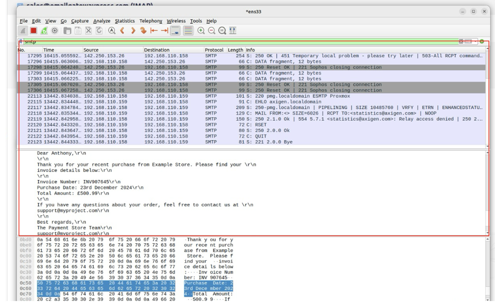
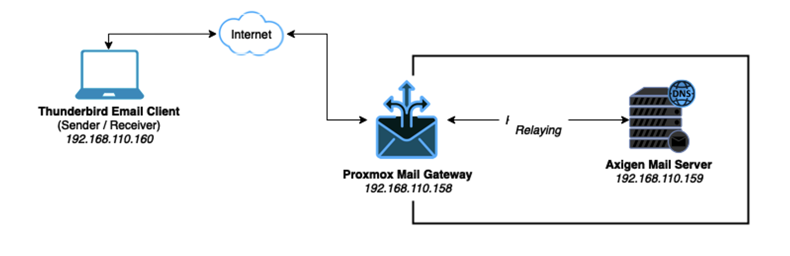

# 🔐 Development of a Secure Email Gateway Architecture Using Open-Source Tools

This project demonstrates a multi-layered email security system built with open-source tools: **Axigen Mail Server**, **Proxmox Mail Gateway**, **Thunderbird**, **GoPhish**, and **PGP Encryption**. It simulates phishing attacks and uses encryption, filtering, and traffic inspection to protect communication channels.

## 📁 Repository Structure

```
email-security-gateway/
├── README.md
├── screenshots/
│   ├── architecture-diagram.png
│   ├── axigen-config.png
│   ├── pmg-dashboard.png
│   ├── thunderbird-pgp.png
│   ├── phishing-captured.png
│   ├── email-cleartext.png
│   ├── email-encrypted.png
│   ├── wireshark-cleartext.png
│   ├── wireshark-encrypted.png
│   ├── network-topology.png
│   ├── data-flow.png
│   ├── dns-setup.png
│   ├── security-layers.png
```

## 🧠 Project Overview

|                        | Details                                                                 |
|------------------------|-------------------------------------------------------------------------|
| **Objective**          | Build a secure email gateway to detect and block phishing & malware     |
| **Approach**           | Combined encryption, filtering, and simulation to test architecture     |
| **Tools Used**         | Axigen, Proxmox Mail Gateway, Thunderbird, GoPhish, PGP, Wireshark      |
| **Core Defenses**      | Email encryption (PGP), spam/phishing filters, malware detection        |

## 🧩 System Architecture


## 🔐 PGP Encryption & Analysis

### Plaintext Email (No Encryption)

  


### Encrypted Email (PGP Enabled)

  


> 🔍 Wireshark clearly exposes unencrypted emails but fails to decode PGP-secured ones — proving encryption integrity.

## 🚨 Phishing Simulation (GoPhish)

  


- Simulated phishing using GoPhish
- Proxmox identified spoofing, links, and attachments
- Results analyzed and confirmed in dashboards

## 🛠 Tool Snapshots

| Tool               | Screenshot |
|--------------------|------------|
| Axigen Mail Server |  |
| PMG Filters        |  |
| Thunderbird + PGP  |  |

## 🌐 Network Topology & Data Flow

### 📡 Network Topology

The lab simulates enterprise email communication and attacks.  
Includes internal DNS, SMTP relay, phishing source, and traffic monitor.



### 📈 Data Flow Diagram

End-to-end secure email flow, from encryption to delivery, with filtering checkpoints.


## 🌍 DNS Server Setup

A local DNS server (e.g., BIND or Axigen DNS) was configured with:

- **MX Record:** `mail.axigenproject.com`
- **A Record:** Points to Axigen IP (e.g., `192.168.11.107`)
- **SPF Record:** Prevents spoofing

```plaintext
Type    | Host                    | Points To
--------|-------------------------|---------------------
A       | mail.axigenproject.com  | 192.168.11.107
MX      | @axigenproject.com      | mail.axigenproject.com
TXT     | @axigenproject.com      | "v=spf1 mx -all"
```


## 🔐 Security Layer Design

Multi-layered security approach based on **Defense in Depth**.

| Layer                 | Purpose                                  | Tools Used                |
|----------------------|-------------------------------------------|---------------------------|
| Application Layer    | PGP Encryption                            | Thunderbird + GnuPG       |
| Transport Layer      | Secure SMTP Routing                       | Axigen Mail Server        |
| Network Layer        | Spam/Phishing/Malware Filtering           | Proxmox Mail Gateway      |
| DNS Layer            | Domain Trust & Routing                    | Internal DNS Server       |
| Monitoring Layer     | Visibility & Traffic Inspection           | Wireshark, Snort (opt)    |


## ⚙️ Quick Setup Summary (with Commands)

### 📨 Axigen Mail Server Installation (Ubuntu/Debian)
```bash
wget https://www.axigen.com/mail-server/download/axigen-10.5.3.deb
sudo dpkg -i axigen-10.5.3.deb
sudo systemctl start axigen
sudo systemctl enable axigen
```
Visit `https://<your-server-ip>:9443` to finish configuration.

### 🧱 Proxmox Mail Gateway (PMG)

Download ISO:  
[https://www.proxmox.com/en/proxmox-mail-gateway](https://www.proxmox.com/en/proxmox-mail-gateway)

Install in VirtualBox or on hardware → Access at `https://<pmg-ip>:8006`  
Configure relay domains, spam filtering, and antivirus.

### 🔐 Thunderbird + GnuPG (PGP Setup)

```bash
sudo apt update
sudo apt install thunderbird gnupg2
```
In Thunderbird:  
Go to Settings → End-to-End Encryption → Generate PGP Key Pair  
Enable PGP for all outgoing messages

### 🎯 GoPhish Installation

```bash
wget https://github.com/gophish/gophish/releases/download/v0.11.0/gophish-v0.11.0-linux-64bit.zip
unzip gophish-v0.11.0-linux-64bit.zip
cd gophish
sudo ./gophish
```
Access GoPhish via: `https://localhost:3333` (default credentials: `admin:gophish`)

### 🧪 Swaks – Test SMTP Relay or Spoofing

```bash
sudo apt install swaks
swaks --to victim@domain.com --from attacker@spoofed.com --server <your-mail-ip>
```

### 🧠 Wireshark – Monitor Traffic

```bash
sudo apt install wireshark
```
Capture on interfaces like `eth0`, filtering for:
```
tcp.port == 25 || tcp.port == 587 || tcp.port == 443
```

## 📊 Results

✅ PGP encryption confirmed secure via Wireshark  
✅ Proxmox Mail Gateway successfully filtered phishing and spam  
✅ Axigen mail routing and DNS resolution worked as configured  
✅ GoPhish demonstrated common spoofing tactics for awareness testing


## 👨🏽‍💻 Author

**Ajijola Oluwafemi Blessing**  
Cybersecurity Analyst | Researcher  
📍 United Kingdom  
📧 oluwafemiblessingajijola@gmail.com  
[](https://www.linkedin.com/in/ajijola-oluwafemi-ba839712a/)  


> _“Encryption, simulation, and verification — layered email security is not optional; it's critical.”_
