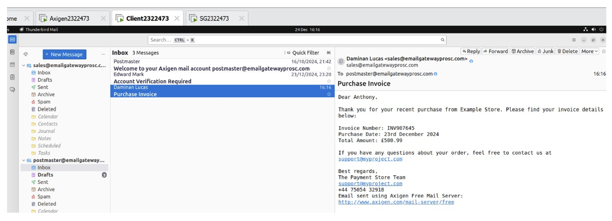

# 🔐 Development of a Secure Email Gateway Architecture Using Open-Source Tools

This project demonstrates a multi-layered email security system built with open-source tools: **Axigen Mail Server**, **Proxmox Mail Gateway**, **Thunderbird**, **GoPhish**, and **PGP Encryption**. It simulates phishing attacks and uses encryption, filtering, and traffic inspection to protect communication channels.

---

## 📁 Repository Structure

```
email-security-gateway/
├── README.md
├── screenshots/
│   ├── architecture-diagram.png
│   ├── axigen-config.png
│   ├── pmg-dashboard.png
│   ├── thunderbird-pgp.png
│   ├── phishing-captured.png
│   ├── email-cleartext.png
│   ├── email-encrypted.png
│   ├── wireshark-cleartext.png
│   ├── wireshark-encrypted.png
├── configs/
│   ├── axigen-settings.conf
│   ├── pmg-rules.conf
│   ├── pgp-public-key.asc
│   ├── pgp-private-key.asc
├── traffic-captures/
│   └── phishing-smtp-session.pcap
├── report/
│   └── project-report.pdf
```

---

## 🧠 System Architecture


> **Note:** If the image above doesn't load, ensure it’s located in the `/screenshots` folder and named `architecture-diagram.png`.

---

## 🔐 PGP Encryption & Analysis

### Plaintext Email (No Encryption)

  


### Encrypted Email (PGP Enabled)

  


> 🔍 Wireshark clearly exposes the content of unencrypted emails, while PGP-encrypted traffic is fully secure and unreadable during transit.

---

## 🚨 Phishing Simulation (GoPhish)

  


- Simulated spear-phishing emails using GoPhish
- Proxmox Mail Gateway flagged, quarantined, or rejected high-risk emails based on filtering rules, attachments, and sender fingerprinting

---

## 🛠 Tool Snapshots

| Tool               | Screenshot |
|--------------------|------------|
| Axigen Mail Server |  |
| PMG Filters        |  |
| Thunderbird + PGP  |  |

---

## ⚙️ Quick Setup Summary

1. Install **Axigen Mail Server** and configure domain + SMTP relay
2. Set up **Thunderbird** with **GnuPG (PGP)** encryption
3. Deploy **Proxmox Mail Gateway** as a filter and outbound/inbound scanner
4. Launch phishing campaigns via **GoPhish**
5. Analyze email sessions and encryption status using **Wireshark**

---

## 📊 Results

✅ PGP encryption confirmed effective using network capture  
✅ GoPhish emails simulated advanced phishing attacks  
✅ Proxmox detected malicious payloads, URLs, spoofing  
✅ Secure email relay with layered defense demonstrated

---

## 📘 References

- [Axigen Mail Server](https://www.axigen.com/mail-server/)
- [Proxmox Mail Gateway](https://www.proxmox.com/en/proxmox-mail-gateway)
- [GoPhish](https://getgophish.com/)
- [Thunderbird](https://www.thunderbird.net/)
- [Wireshark](https://www.wireshark.org/)
- [GnuPG](https://gnupg.org/)

---

## 👨🏽‍💻 Author

**Ajijola Oluwafemi Blessing**  
Cybersecurity Analyst | Researcher  
📍 United Kingdom  
📧 oluwafemiblessingajijola@gmail.com  
[](https://www.linkedin.com/in/ajijola-oluwafemi-ba839712a/)  


---

> _“Encryption, simulation, and verification — layered email security is not optional; it's critical.”_
